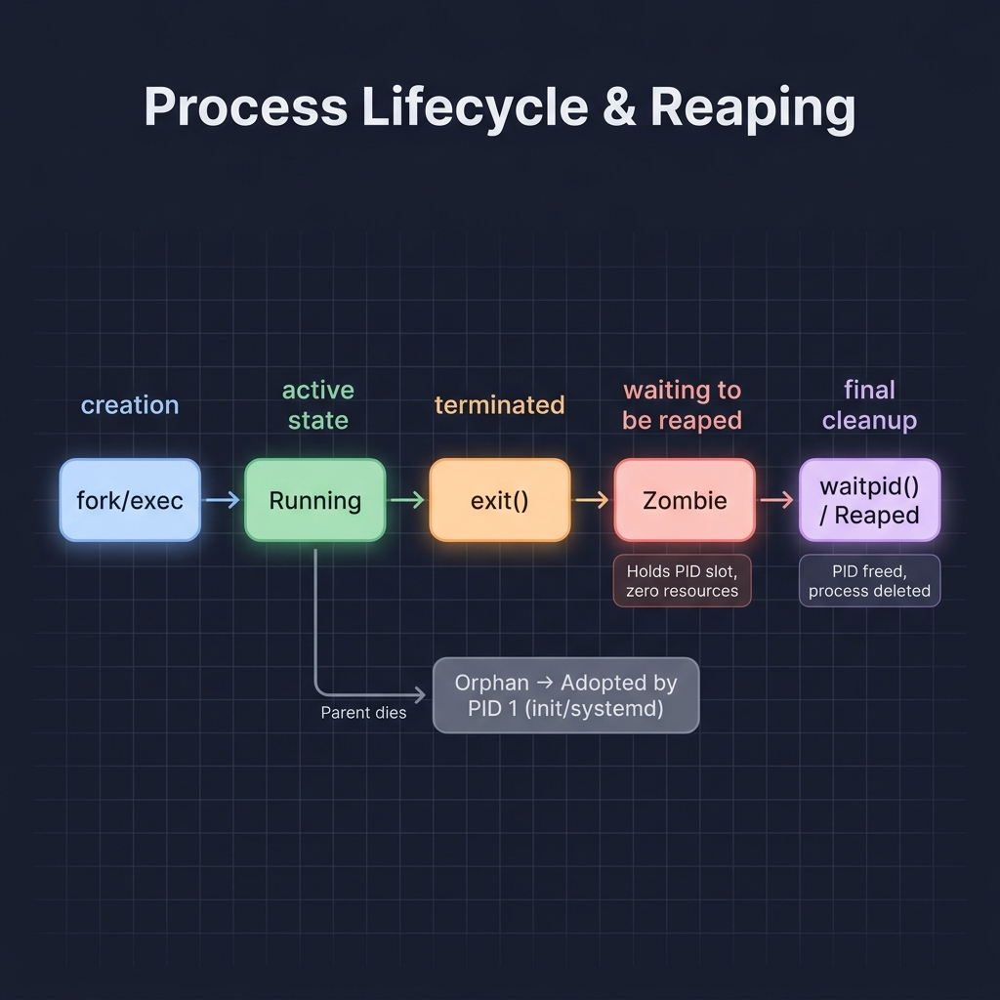
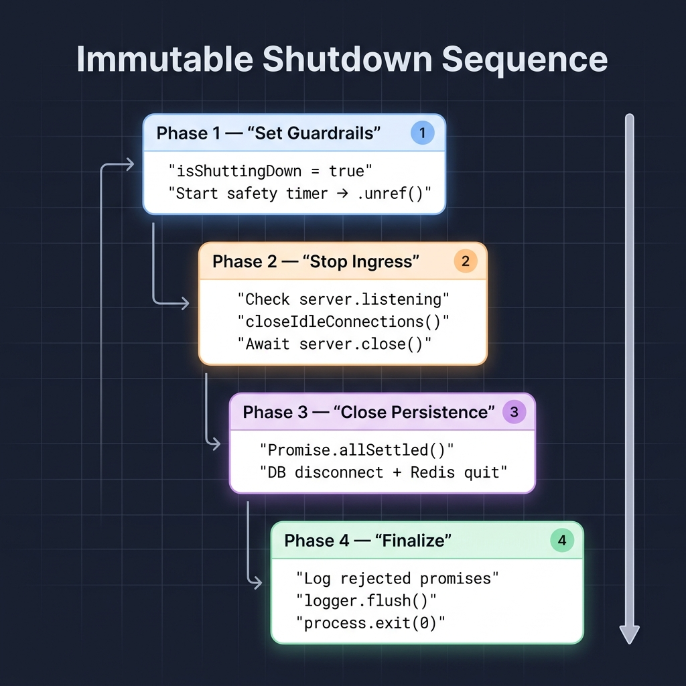

# Graceful Shutdown Mechanics

A production server that crashes mid-request leaks database connections, drops user data, and leaves broken state behind. Graceful shutdown is the discipline of catching termination signals, draining active work, cleaning up resources, and exiting cleanly — so none of that happens.

This guide covers the full stack: OS-level process mechanics, server draining behavior, and the exact shutdown sequence a production Node.js application should follow.

---

## Part 1: OS Foundations — Processes and Signals

### UNIX, Linux, and POSIX

These three terms get used interchangeably, but they refer to different things.

- **UNIX** is a registered trademark and a certified specification (the Single UNIX Specification). Operating systems like macOS and IBM AIX pay to be officially certified as UNIX.
- **Linux** is a free, open-source kernel that mirrors the architecture and behavior of UNIX — but it is not certified and does not hold the trademark. It is "UNIX-like."
- **POSIX** (Portable Operating System Interface) is the interface standard that bridges both worlds. It guarantees that core system calls (`fork`, `exec`, `kill`, `exit`) and signals behave identically across UNIX and Linux systems.

For the purpose of this guide, the signal handling and process lifecycle behavior described below applies consistently across POSIX-compliant systems.

---

### File Descriptors and Sockets

The OS kernel tracks every open resource — files, network connections, standard output — using simple integers called **File Descriptors** (FDs). In UNIX philosophy, everything is a file: a regular file on disk gets FD 3, a TCP connection gets FD 4, and they're both just integers to the kernel.

A **socket** is a software abstraction that lives in kernel memory. It represents one endpoint of a two-way network connection, defined by a 4-tuple: `Local IP:Port ↔ Remote IP:Port`.

The critical separation of concerns here:

| Layer                     | Responsibility                                                                                            |
| ------------------------- | --------------------------------------------------------------------------------------------------------- |
| **OS Kernel**             | Handles the raw TCP 3-way handshake. Creates the socket file descriptor.                                  |
| **Application (Node.js)** | Never touches the TCP handshake. It only reads and writes HTTP bytes over the socket the kernel provides. |

This distinction matters during shutdown — the kernel owns the connection lifecycle, and the application can only request that the kernel stop accepting new ones.

---

### The Process Lifecycle

<p align="center">
  
  <br>
  <em>Figure 1: The full process lifecycle, from creation through zombie state to final reaping.</em>
</p>

Every process follows this path:

```
Created (fork/exec) → Running → Terminated (exit) → Reaped (waitpid)
```

The interesting part is what happens between "terminated" and "reaped."

**The Zombie State.** When an application calls `process.exit()`, the OS immediately frees its RAM and closes its file descriptors. But the process isn't fully deleted — it enters a **zombie** state. A zombie uses zero resources, but it occupies one PID slot in the OS process table to hold its exit code.

**Reaping.** The parent process calls `waitpid()` to read the zombie's exit code. Once read, the OS definitively removes the process from the table and frees the PID.

**Orphan Protection.** If a parent dies without reaping its children, the OS `init` process (PID 1 — `systemd` on modern Linux, `tini` inside Docker) adopts the orphaned zombies and reaps them automatically. Without this mechanism, leaked zombies would eventually exhaust the PID space.

---

### Signals: How Processes Receive Shutdown Commands

Signals are asynchronous notifications sent by the OS kernel to interrupt a process and demand an action.

| Signal    | Number | Trigger                                            | Catchable? | Purpose                            |
| --------- | ------ | -------------------------------------------------- | ---------- | ---------------------------------- |
| `SIGINT`  | 2      | User presses `Ctrl+C`                              | Yes        | Interactive interrupt              |
| `SIGTERM` | 15     | Orchestrator request (Kubernetes, Docker, systemd) | Yes        | Standard graceful shutdown request |
| `SIGKILL` | 9      | Kernel-level forced kill                           | **No**     | Immediate, unblockable termination |

`SIGTERM` is the signal that matters for graceful shutdown. Orchestrators send it first, giving the application a window to clean up. If the application doesn't exit within a timeout (typically 30 seconds in Kubernetes), the orchestrator escalates to `SIGKILL`.

> [!IMPORTANT]
> Applications **cannot** catch, block, or handle `SIGKILL`. The kernel destroys the process context instantly. Your shutdown logic only gets to run if you handle `SIGTERM`.

---

### Exit Codes

Exit codes communicate the termination state back to the OS and orchestrators.

| Code             | Meaning                                          | Triggered By                      |
| ---------------- | ------------------------------------------------ | --------------------------------- |
| `0`              | Clean, intentional, successful exit              | `process.exit(0)`                 |
| `1`              | Failed exit — uncaught error or shutdown timeout | `process.exit(1)`                 |
| `137` (128 + 9)  | Forcefully killed by `SIGKILL`                   | OS kernel (OOM, timeout exceeded) |
| `143` (128 + 15) | Terminated by `SIGTERM`                          | Orchestrator signal               |

The formula `128 + signal_number` is the POSIX convention for signal-induced exits. Exit code `137` instantly tells an operator: "this process was `SIGKILL`ed."

---

## Part 2: Server Mechanics and Connection Draining

### Server Lifecycle — Creation vs. Listening

A common misconception is that creating a server and listening on a port are the same operation. They aren't.

```js
// Step 1: Creates the server object in memory. It is NOT bound to any port.
// server.listening === false
const server = http.createServer(app);

// Step 2: Asks the OS to bind port 3000 and start routing traffic.
// server.listening === true
server.listen(3000);
```

The Express shortcut `app.listen(3000)` combines both steps into one call, but this creates a problem: your shutdown handler may need a reference to `server` before it starts listening. If a `SIGTERM` arrives during startup, a combined call can leave you with an `undefined` server variable.

> [!NOTE]
> **Best Practice:** Create the server early with `const server = http.createServer(app)`, then call `server.listen()` separately. This guarantees you can safely check `server.listening` in your shutdown handler to avoid calling `server.close()` on a server that never started.

---

### The `server.close()` Mechanism

When you call `server.close()`, a very specific sequence occurs:

1. **Port Unbinding** — The OS kernel instantly stops accepting new TCP connection requests on the port. Load balancers observing the port see it drop and stop routing traffic.
2. **Socket Retention** — All _existing_ TCP sockets stay open. In-flight requests continue executing.
3. **The Wait** — The server waits for every active HTTP request to finish processing and deliver its response.
4. **The Callback** — Only when the active socket count drops to zero does Node.js fire the `server.close()` callback (or resolve the wrapped Promise), signaling full drainage.

This behavior is exactly what makes graceful shutdown possible: new traffic is rejected while existing work completes.

---

### The Keep-Alive Trap

Here's where most implementations silently break.

HTTP/1.1 uses persistent **Keep-Alive** connections by default. After an HTTP request completes, the client (browser or load balancer) keeps the underlying TCP socket open for efficiency — anticipating future requests on the same connection.

The problem: `server.close()` waits for _all_ sockets to close before firing its callback. Idle Keep-Alive sockets have no active request, but they're still open. Your shutdown **hangs indefinitely**, waiting for sockets that will never close on their own.

The fix:

```js
server.close(); // Stop accepting new connections
server.closeIdleConnections(); // Immediately sever empty Keep-Alive sockets
```

`closeIdleConnections()` destroys only idle, empty sockets. Sockets currently processing in-flight requests are preserved until the request completes.

> [!CAUTION]
> If you rely solely on `server.close()` without calling `closeIdleConnections()`, your graceful shutdown will hang forever in any application that receives Keep-Alive connections — which is virtually every production HTTP server.

---

### Connection Draining and the Golden Rule

**Connection draining** is the act of allowing currently executing (in-flight) requests the time they need to complete their logic, run database queries, and deliver responses before pulling the plug.

> [!IMPORTANT]
> **The Golden Rule of Graceful Shutdown:** Never close your database or cache connections before network draining is complete.

The consequence of violating this rule is immediate: if you close the database while requests are still in-flight, any executing queries crash. Users receive unhandled `HTTP 500 Internal Server Error` responses, data mutations fail midway, and database transactions forcefully rollback — potentially leaving data in a partially-written, inconsistent state.

---

## Part 3: Resource Cleanup and Production Architecture

### Persistence Layer Cleanup

Calling `prisma.$disconnect()` or `redis.quit()` only closes the TCP connection between your Node.js application and the remote database or cache server. The Postgres or Redis servers themselves keep running — this is purely about releasing your application's end of the socket.

**Why cleanup matters:** If an application dies or restarts without closing these connections, the abandoned sockets stay open on the database server. Over repeated restarts, the database accumulates orphaned connections until it hits its `max_connections` limit and starts rejecting every new connection with "Too many connections" errors — crashing the entire system.

**Concurrent cleanup:** Because Redis and the database are independent services, there's no ordering dependency between their disconnections. Close them concurrently with `Promise.allSettled()` to save time:

```js
await Promise.allSettled([prisma.$disconnect(), redis.quit()]);
```

**In-memory timers and background tasks:** Any `setTimeout` or `setInterval` timers are instantly destroyed when `process.exit()` is called. If those timers manage background work (like batched writes), that work is silently lost. To prevent data loss during shutdown, offload background tasks to persistent stores (like Redis queues or a message broker) so a new instance can pick them up.

---

### The Safety Net Timer

Graceful shutdowns can hang if a database query deadlocks, a network call gets stuck, or a connection never fully drains. You need a hard timeout as a safety net — typically 10 seconds.

But there's a subtlety in how you implement it.

**The problem with a standard `setTimeout`:** Node.js keeps the process alive as long as there are active timers in the event loop. A 10-second safety timer means the process stays alive for the full 10 seconds even if cleanup finishes in 2 seconds.

**`clearTimeout()` vs. `timer.unref()`:**

| Approach              | Behavior                                                                 | Risk                                                                    |
| --------------------- | ------------------------------------------------------------------------ | ----------------------------------------------------------------------- |
| `clearTimeout(timer)` | Cancels the timer entirely after cleanup                                 | If cleanup hangs _after_ you clear the timer, the process hangs forever |
| `timer.unref()`       | Tells the event loop: "don't keep the process alive just for this timer" | None — this is the correct approach                                     |

With `.unref()`, the timer is _present but passive_. If cleanup finishes in 2 seconds, the event loop has no remaining active handles and exits naturally at 2 seconds. If cleanup gets stuck, the timer still fires at 10 seconds and forces `process.exit(1)`.

```js
const shutdownTimer = setTimeout(() => {
  logger.error("Shutdown timed out — forcing exit");
  process.exit(1);
}, 10000);

shutdownTimer.unref(); // Don't keep the process alive just for this timer
```

---

### Log Flushing

High-performance loggers like Pino and Winston buffer log entries in RAM and write them to disk in batches to reduce I/O overhead. Calling `process.exit()` instantly wipes RAM — destroying the final buffered log entries that explain _how_ and _why_ the application shut down.

Call `logger.flush()` immediately before exiting to force a synchronous write of all pending log entries to stdout or disk. These final logs are often the most valuable during incident investigation.

---

### Error Resilience

Three guardrails protect the shutdown sequence from edge cases:

**`Promise.allSettled()` over `Promise.all()`** — If `redis.quit()` throws an error, you still want `prisma.$disconnect()` to execute. `Promise.all()` short-circuits on the first rejection and skips the remaining cleanups. `Promise.allSettled()` runs every cleanup regardless and reports all results.

**Duplicate Signal Guard** — A boolean flag (`isShuttingDown`) prevents the shutdown sequence from running twice if a user spams `Ctrl+C` or the orchestrator sends overlapping `SIGTERM` signals.

```js
let isShuttingDown = false;

async function shutdown() {
  if (isShuttingDown) return;
  isShuttingDown = true;
  // ... cleanup logic
}
```

**Uncaught Exception Handling** — Attaching the shutdown handler to `uncaughtException` and `unhandledRejection` ensures that unexpected crashes trigger the same safe cleanup sequence — draining connections, closing the database, flushing logs — rather than a dirty immediate exit.

---

### The Immutable Shutdown Sequence

<p align="center">
  
  <br>
  <em>Figure 2: The four-phase shutdown sequence that must execute in this exact order.</em>
</p>

A correct graceful shutdown executes these four phases in this exact, unchangeable order:

**Phase 1 — Set Guardrails**

1. Set `isShuttingDown = true` to block duplicate execution.
2. Start a 10-second `setTimeout` and immediately call `.unref()` on it.

**Phase 2 — Stop Ingress**

1. Check if `server.listening` is true.
2. Call `server.closeIdleConnections()` to kill empty Keep-Alive sockets.
3. Await `server.close()` to unbind the port and drain in-flight requests.

**Phase 3 — Close Persistence Layers**

1. Now that no requests are running, concurrently await `Promise.allSettled()` for database and cache disconnections.

**Phase 4 — Finalize**

1. Inspect the results array for rejected promises and log any cleanup failures.
2. Call `logger.flush()`.
3. Call `process.exit(0)` — or `process.exit(1)` if a fatal error occurred during the sequence.

> [!CAUTION]
> The ordering is non-negotiable. Closing the database before draining connections (swapping Phase 2 and 3) crashes in-flight requests. Skipping the guardrails (Phase 1) causes double-execution on overlapping signals. Skipping log flushing (Phase 4) destroys the evidence you need during incident response.

---

## 🌟 Support & Contribute

If you found this article helpful, please consider:

- **Starring** ⭐ the [knowledge-base](https://github.com/utkarshj014/knowledge-base) repository to show support.
- **Following** 👥 me [utkarshj014](https://github.com/utkarshj014) on GitHub.
- **Watching** 👀 the repository for updates on new articles.
- **Contributing** 🛠️ by opening a Pull Request with edits or additions.
- **Sharing** 📢 this guide with other developers who might benefit from it.
