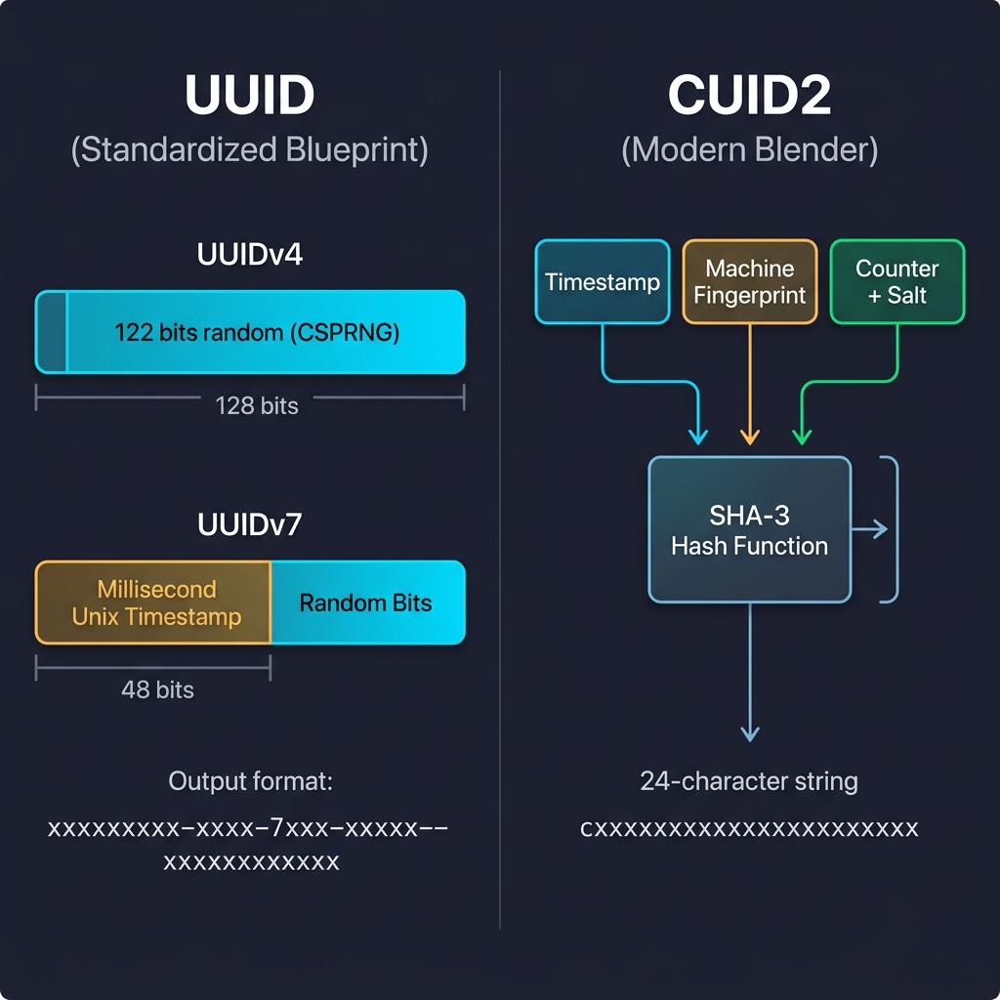
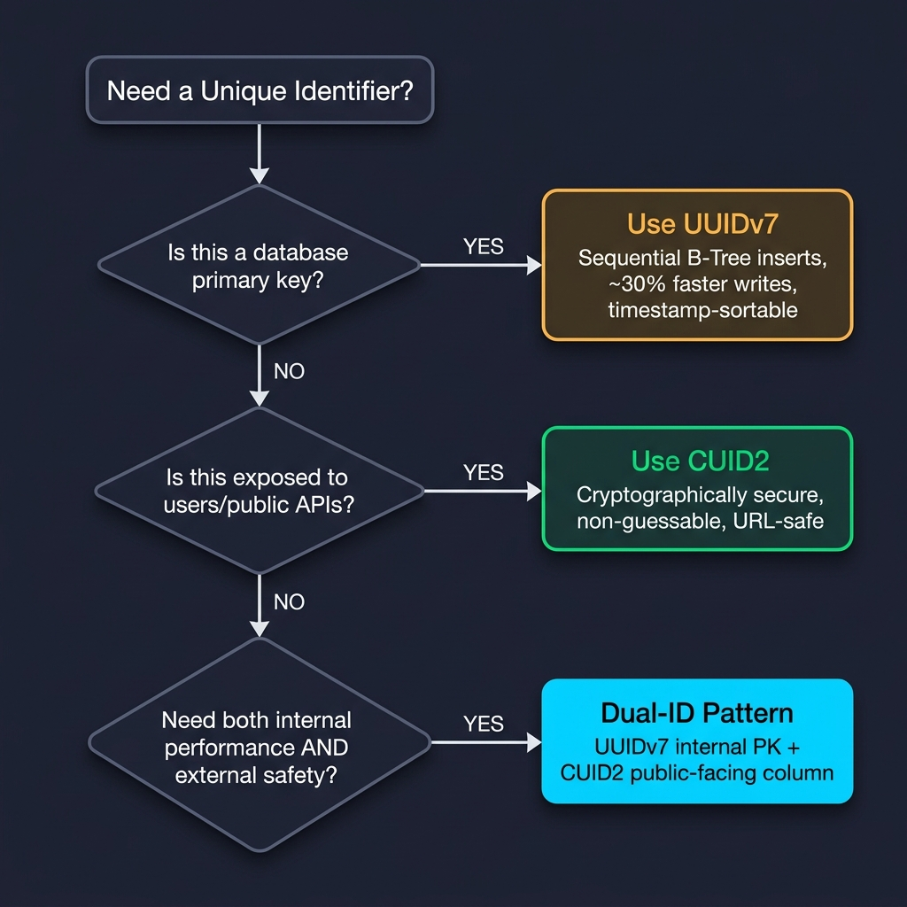

# Unique Identifiers: UUID vs CUID

Distributed systems need to generate unique identifiers across multiple servers simultaneously — without checking a central database first. The challenge isn't just uniqueness; it's achieving uniqueness at scale while satisfying conflicting demands: database performance, security, sortability, and URL safety.

This article covers how the two dominant identifier ecosystems — **UUID** and **CUID** — solve that problem through fundamentally different design philosophies, what trade-offs each makes, and how to pick the right one for each layer of your architecture.

---

## The Core Problem

A single-server system can use a simple auto-incrementing integer (`1`, `2`, `3`, …). A `BIGINT` sequence consumes only 8 bytes, appends sequentially to a B-Tree index, and is trivially fast.

This breaks down the moment you have two servers generating IDs at the same time. Both could assign `42` to different records, and without coordinating through a shared counter (a bottleneck), collisions are inevitable.

The solution is **Unique Identifiers (UIDs)** — algorithms that generate globally unique strings by combining two ingredients:

- **Entropy (Randomness):** A wide pool of random characters that makes the statistical odds of a collision practically zero.
- **Context (Structure):** Real-world variables packed into the ID — timestamps, machine fingerprints, counters — that make it unique by the circumstances of its creation.

Every UID scheme balances these two ingredients differently, and that balance determines where it excels and where it falls short.

---

## The "Cryptographically Secure" Tag

Both UUIDv4 and CUID2 are described as **cryptographically secure**, but they earn that label through entirely different methods.

"Cryptographically secure" is a strict mathematical compliance marker. It signals that a system's output satisfies rigorous defense principles and is proven to resist adversarial attacks — meaning an attacker who sees a sequence of generated IDs cannot predict the next one.

- **UUIDv4** achieves this by pulling randomness directly from the operating system's Cryptographically Secure Pseudo-Random Number Generator (CSPRNG), which lives inside the OS kernel.
- **CUID2** achieves this by combining structured inputs (timestamp, machine fingerprint, counter) with a random salt, then passing everything through a one-way cryptographic hash function (SHA-3).

Both are unpredictable. The mechanism is just different.

---

## The UUID Ecosystem — The Standardized Blueprint

UUID (Universally Unique Identifier) is a globally standardized 128-bit structure, output as a 36-character hexadecimal string separated by hyphens:

```
xxxxxxxx-xxxx-Mxxx-Nxxx-xxxxxxxxxxxx
```

The `M` nibble identifies the version. Two versions dominate modern usage.

### UUIDv4 — Pure Randomness

UUIDv4 fills 122 of its 128 bits with random data from the OS kernel's CSPRNG. The remaining 6 bits are fixed version/variant markers.

```bash
# Generate a UUIDv4 in Node.js
$ node -e "console.log(crypto.randomUUID())"
a3b8f042-7e91-4d3c-b6a1-9e5f2c8d7a10
```

**Strengths:**

- Cryptographically secure and completely unpredictable.
- No timestamp leakage — reveals nothing about when it was created.

**Weakness:**

- Terrible database performance. Because the values are fully random, each insert lands at an unpredictable position in the B-Tree index, forcing constant page splits and rebalancing across the entire tree.

---

### UUIDv7 — Time-Sorted Randomness

[RFC 9562](https://datatracker.ietf.org/doc/html/rfc9562) standardizes UUIDv7 by splitting the 128 bits into two regions:

| Bit Range | Content                         |
| --------- | ------------------------------- |
| 0–47      | Millisecond-precision Unix timestamp |
| 48–127    | Random bits (with version/variant markers) |

The timestamp occupies the most significant bits, so IDs generated later are always lexicographically greater than earlier ones.

```bash
# Two UUIDv7s generated moments apart — note the sorted prefixes
018f6e2a-1c00-7abc-8def-1234567890ab   # earlier
018f6e2a-1c05-7def-9abc-abcdef012345   # later
```

**Database performance:** Because values increase monotonically, new rows always append to the rightmost leaf node of the B-Tree index. No random page splits. No index fragmentation. [Benchmarks show ~30–35% faster insert speeds](https://dev.to/umangsinha12/postgresql-uuid-performance-benchmarking-random-v4-and-time-based-v7-uuids-n9b) and ~20% more compact index sizes compared to UUIDv4.

**Storage cost:** The same 16-byte (128-bit) footprint as every other UUID version.

---

## The CUID Ecosystem — The Modern Blender

CUID2 (Collision-resistant Unique Identifier, version 2) takes a fundamentally different approach. Instead of a rigid bit-layout, it compiles multiple context signals and shreds them through a hash function.

**Output format:** A clean, lowercase, 24-character alphanumeric string that always starts with a letter:

```
cxxxxxxxxxxxxxxxxxxxxxxx
```

### How It Works

CUID2 gathers three inputs:

1. **System timestamp** — when the ID was generated.
2. **Machine fingerprint** — derived from the host environment.
3. **Operational counter + random salt** — a monotonic counter mixed with fresh randomness.

These inputs are concatenated and passed through a **cryptographic hash function** (SHA-3). The hash function is one-way: the output cannot be reversed to recover the inputs, and changing a single bit of input shifts the entire output unpredictably (the **avalanche effect**).

The random salt mixed in before hashing ensures that even identical inputs at the exact same millisecond on the same machine still produce completely unique outputs. This technique is called **salting** — injecting meaningless random data into inputs before hashing to guarantee uniqueness.

<p align="center">
  
  <br>
  <em>Figure 1: The two architecture philosophies — UUID's rigid bit-layout vs CUID2's hash-based blending.</em>
</p>

### Trade-offs

| Property               | CUID2                              |
| ---------------------- | ---------------------------------- |
| **Security**           | Cryptographically secure. Non-guessable. No timestamp leakage. |
| **URL safety**         | Lowercase alphanumeric — no hyphens, no encoding issues. |
| **Database performance** | Sub-optimal. The hash intentionally scrambles chronological order, causing the same B-Tree fragmentation as UUIDv4. |

> [!IMPORTANT]
> **Do not use CUID2 as a database primary key.** The hashing destroys sort order by design. Use it where unpredictability and URL-safety matter more than index performance.

---

## Why B-Trees Care About Sort Order

Relational databases (PostgreSQL, MySQL) index primary keys using **B-Tree indexes** — multi-layered, hierarchical lookup trees that locate one record out of millions in 3–4 hops.

B-Trees are **strictly balanced**: all leaf nodes (where data physically sits) are kept at the exact same depth from the root. When a leaf node fills up, it splits, and the tree restructures upward to stay balanced.

**Sequential inserts (UUIDv7, BIGINT):**

New values are always greater than existing ones, so they always land in the rightmost leaf. Splits are localized, the tree grows upward, and search depths stay shallow. Write performance is optimal.

**Random inserts (UUIDv4, CUID2):**

Values land at unpredictable positions across the tree. The database must load random index pages from disk, split them, and rebalance surrounding nodes. This causes **index fragmentation** — wasted space, scattered disk I/O, and degraded write speeds that compound as the table grows.

---

## Security Vulnerabilities of Time-Sorted IDs

UUIDv7's timestamp is embedded in plaintext at the front of the string. Anyone with the ID can extract the exact creation time:

```javascript
// Extract timestamp from a UUIDv7
const uuid = "018f6e2a-1c00-7abc-8def-1234567890ab";
const timestamp = parseInt(uuid.replace(/-/g, "").slice(0, 12), 16);
console.log(new Date(timestamp));
// → 2024-05-15T10:30:00.000Z
```

This leaks information: when a user registered, when a transaction happened, how many records exist in a time range.

> [!CAUTION]
> **Never use UUIDv7 for:** security tokens, API keys, password reset links, session IDs, or any context where revealing creation time or enabling enumeration is a security risk.

### Mitigation: The Dual-ID Pattern

Use two columns per table:

| Column        | Type    | Purpose                                |
| ------------- | ------- | -------------------------------------- |
| `id`          | UUIDv7  | Internal primary key. Used for joins, indexes, and sorting. Never exposed to clients. |
| `external_id` | CUID2   | Public-facing identifier. Used in URLs, API responses, and client-side references. |

The internal key gives you maximum database performance. The external key gives you cryptographic unpredictability and URL safety. Clients never see the UUIDv7; the server maps between them.

### Mitigation: The Obfuscation Pattern

If a second column is overkill, keep a sequential internal ID but encode it through a reversible obfuscation library (like [Sqids](https://sqids.org/)) before exposing it to clients. The server encodes `42` → `"k9Bx3"` on output and decodes `"k9Bx3"` → `42` on input, hiding the sequence without adding a column.

---

## Where CUIDs Excel

CUID2's strengths — cryptographic unpredictability, URL-safe format, client-side generation without coordination — make it the right tool for specific categories:

- **Idempotency Keys:** Client-generated tokens (e.g., `Idempotency-Key` headers) that prevent duplicate payment submissions. The key lives in the request, not the database index.
- **Temporary Sessions:** Tracking transient user data or analytical events across checkout flows in cache layers like Redis, where B-Tree index performance is irrelevant.
- **File Uploads:** Naming files uploaded directly from clients to object storage (S3, GCS) to prevent naming collisions without querying a central database.
- **Real-time Ephemeral Data:** Generating unique, non-guessable WebSocket channel names or collaboration room IDs that live only in memory.
- **UI Hydration:** Creating collision-free HTML element `id` attributes dynamically across nested frontend component trees during Server-Side Rendering (SSR).

---

## Decision Matrix

<p align="center">
  
  <br>
  <em>Figure 2: Choosing the right identifier for each layer of your architecture.</em>
</p>

| Scenario                        | Choose         | Reason                                                    |
| ------------------------------- | -------------- | --------------------------------------------------------- |
| Database primary key            | **UUIDv7**     | Sequential B-Tree inserts. ~30% faster writes. Timestamp-sortable. |
| Public API response ID          | **CUID2**      | Cryptographically unpredictable. URL-safe. No timestamp leakage. |
| Internal + external (both)      | **Dual-ID**    | UUIDv7 for the PK, CUID2 for the public-facing column.    |
| Idempotency key / cache key     | **CUID2**      | Client-generated. No database index involved.              |
| File upload naming              | **CUID2**      | Collision-free without coordination. URL-safe.             |
| Ephemeral WebSocket channel     | **CUID2**      | In-memory only. Non-guessable.                             |
| Simple single-server system     | **BIGINT**     | 8 bytes. Maximum index density. No distributed requirement. |

---

## 🌟 Support & Contribute

If you found this article helpful, please consider:

- **Starring** ⭐ the [knowledge-base](https://github.com/utkarshj014/knowledge-base) repository to show support.
- **Following** 👥 me [utkarshj014](https://github.com/utkarshj014) on GitHub.
- **Watching** 👀 the repository for updates on new articles.
- **Contributing** 🛠️ by opening a Pull Request with edits or additions.
- **Sharing** 📢 this guide with other developers who might benefit from it.
