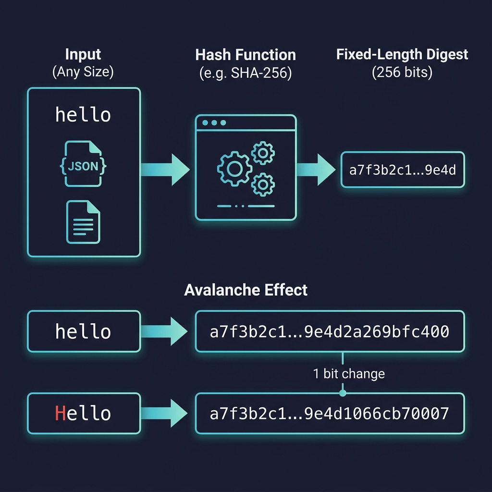
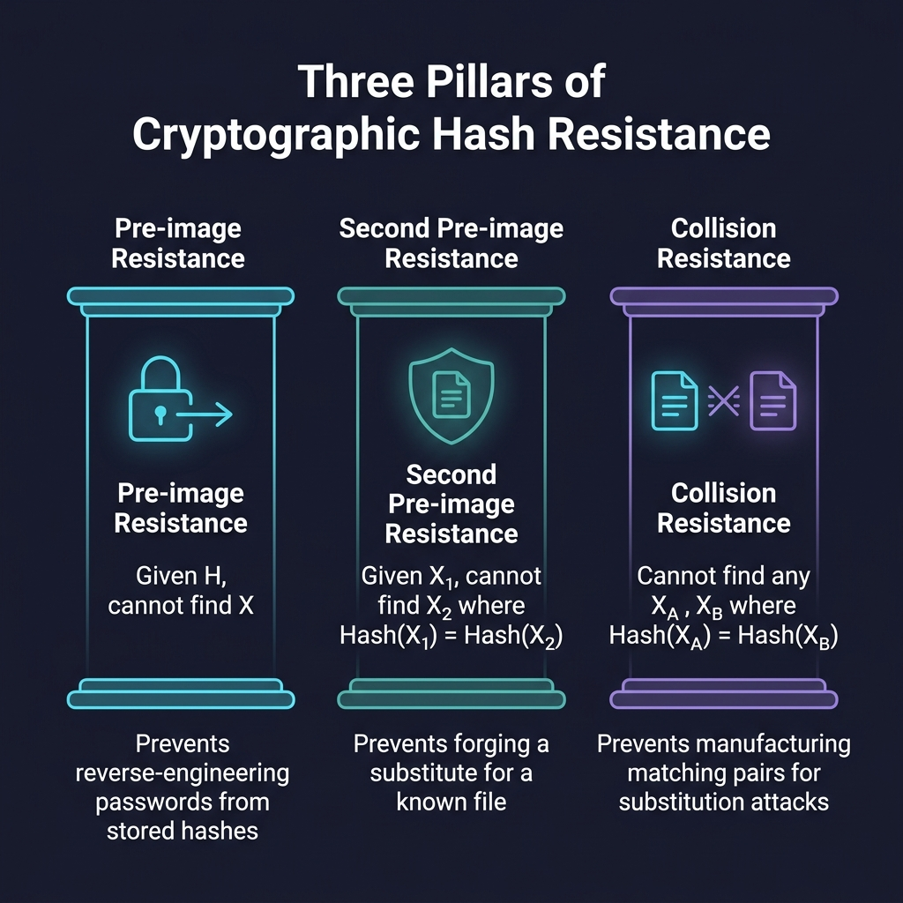

# Hashing & Cryptography

## Operational Vocabulary

Before diving into mechanics, a few terms need to be precise — they get misused constantly.

**Hash** is not a single thing. It refers to the entire act of chopping up, mixing, and condensing data into a compact representation. The word covers the full execution pipeline:

- **Hash Function** — the mathematical algorithm that ingests data. This is the engine.
- **Hash Value / Digest** — the fixed-length output the engine produces. Also called the hash output. This is the result.

**Cryptographic** is a qualifier, not a category. When applied to a function or algorithm, it signals that the system satisfies strict mathematical defense principles and is proven to resist adversarial attacks. Not all hash functions are cryptographic — CRC32 and MurmurHash are hash functions, but they offer no security guarantees.

**Cryptography** is the overarching discipline — the science and engineering of protecting information using mathematical systems. It covers data privacy, authenticity, and non-repudiation (the guarantee that a sender cannot deny having sent a message).

---

## Core Mechanics of a Hash Function

Every hash function — whether cryptographic or not — operates on three structural rules.

<p align="center">
  
  <br>
  <em>Figure 1: The execution pipeline of a standard hash function, showing fixed-length compression and the avalanche effect.</em>
</p>

### 1. Deterministic Execution

A hash function contains no randomness. Feeding the exact same input will yield the identical output every single time, on any system, in any programming language. This is what makes hashes useful for verification — you can independently compute the hash and compare.

```bash
# Hash is computed identically every time:
$ printf "hello" | sha256sum
2cf24dba5fb0a30e26e83b2ac5b9e29e1b161e5c1fa7425e73043362938b9824  -
```

### 2. Fixed-Length Compression

The function accepts an input of any arbitrary size — a single character, a JSON payload, or a multi-gigabyte file — and maps it to a strictly fixed output length. SHA-256, for example, always outputs exactly 256 bits (64 hexadecimal characters) regardless of input size.

This is compression in the mathematical sense: an infinite input space is mapped to a finite output space. That mapping is what makes hash functions useful for indexing, deduplication, and integrity checking.

```bash
# Short text (5 bytes) -> 64 hex characters (32 bytes / 256 bits)
$ printf "hello" | sha256sum
2cf24dba5fb0a30e26e83b2ac5b9e29e1b161e5c1fa7425e73043362938b9824  -

# Large input (1,000,000 characters) -> same 64 hex characters
$ printf "%1000000s" "x" | sha256sum
4a5e378c2e64627b0f69d72111d4d38c6bf839a9cf4e4604e38e6e5898851410  -
```

### 3. The Avalanche Effect

The internal bit-shifting and mixing logic ensure that the tiniest modification to the input — changing a single bit, a single character, or a letter's case — produces a completely different output. The two resulting hashes share no visible pattern.

For example, hashing `hello` and `Hello` through SHA-256 produces two entirely unrelated digests. This property prevents attackers from making educated guesses about an input based on a known similar input's hash.

```bash
# Changing a single character ('h' -> 'H') completely scrambles the output:
$ printf "hello" | sha256sum
2cf24dba5fb0a30e26e83b2ac5b9e29e1b161e5c1fa7425e73043362938b9824  -

$ printf "Hello" | sha256sum
185f8db32271fe25f561a6fc938b2e264306ec304eda518007d1764826381969  -
```

---

## Cryptographic Hash Guarantees: The Three Pillars of Resistance

A hash function earns the "cryptographic" qualifier by satisfying three resistance properties. Each one defends against a specific class of attack.

<p align="center">
  
  <br>
  <em>Figure 2: The three mathematical defense principles that guarantee cryptographic security.</em>
</p>

### 1. Pre-image Resistance (One-Way Lock)

> [!IMPORTANT]
> **The Rule:** Given an output hash `H`, it is computationally impossible to determine any original input `X` such that `Hash(X) = H`.

**Why it matters:** This is what makes password hashing work. Even if an attacker steals a database of hashed passwords, they cannot reverse-engineer the plaintext passwords from the stored hashes. They're forced into brute-force guessing, which a strong hash function makes prohibitively expensive.

### 2. Second Pre-image Resistance (Targeted Forgery Defense)

> [!IMPORTANT]
> **The Rule:** Given a known input `X₁` and its output `H`, it is computationally impossible to find a different input `X₂` such that `Hash(X₁) = Hash(X₂)` (where `X₁ != X₂`).

**Why it matters:** This prevents targeted substitution attacks. An attacker who intercepts a trusted file — a software update binary, a signed webhook payload, a verified document — cannot craft a malicious replacement that produces the same hash. The integrity check will catch the swap.

The key difference from pre-image resistance: here the attacker *knows* the original input and is trying to forge a specific twin for it.

### 3. Collision Resistance (Systemic Substitution Defense)

> [!IMPORTANT]
> **The Rule:** Without any fixed starting point, it is computationally impossible to discover *any* pair of distinct inputs `Xᴬ` and `Xᴮ` that produce an identical output hash (`Hash(Xᴬ) = Hash(Xᴮ)` where `Xᴬ != Xᴮ`).

**Why it matters:** This prevents a more sophisticated attack. An attacker creates two different documents simultaneously — say, a benign contract and a fraudulent one — that happen to produce the same hash. They get the benign version officially signed, then swap in the fraudulent version. Since both hash identically, the signature validates on both.

Collision resistance is strictly stronger than second pre-image resistance. If collisions are feasible, the entire trust model of digital signatures breaks down.

---

## Attack Pattern Summary

| Pillar | Input Constraint | Attacker Strategy | System Threat |
|---|---|---|---|
| **Pre-image** | Output `H` is fixed | Guess/brute-force the input | Information leakage, password decryption |
| **Second Pre-image** | Input `X₁` is fixed | Forge a twin for a specific target | Payload tampering, file spoofing |
| **Collision** | No inputs are fixed | Manufacture a matching pair to swap | Token/contract substitution, signature bypass |

The constraints tighten from top to bottom. Pre-image gives the attacker the least freedom (only an output to work backwards from). Collision gives the most (free choice of both inputs). A cryptographic hash function must resist all three.
